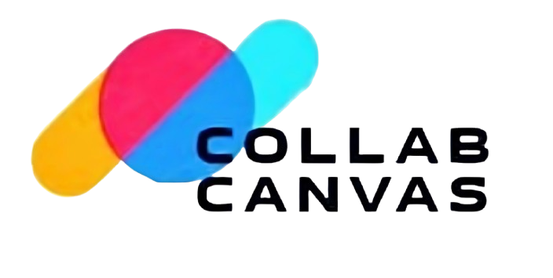

# ColabCanvas

> A real-time collaborative whiteboard application built with React, Node.js, and Socket.IO



## 🎨 Overview

ColabCanvas is a modern, real-time collaborative whiteboard application that enables teams to brainstorm, design, and collaborate visually from anywhere. With intuitive drawing tools, real-time cursor tracking, and seamless collaboration features, it's perfect for remote teams, online education, and creative workshops.

## ✨ Features

### 🖌️ Drawing & Design Tools
- **Multiple Drawing Tools**: Pencil, pen, highlighter, marker with customizable colors and sizes
- **Shape Tools**: Rectangle, circle, ellipse, arrow, line, triangle, diamond, star, hexagon
- **Text Tool**: Add and edit text with various fonts and sizes
- **Eraser Tools**: Standard eraser and partial eraser for precise editing
- **Selection Tool**: Move, resize, and manipulate objects

### 🤝 Collaboration Features
- **Real-time Collaboration**: Multiple users can draw simultaneously
- **Live Cursor Tracking**: See other users' cursors and actions in real-time
- **User Presence**: View who's currently active on the board
- **Board Sharing**: Generate shareable invite links for instant collaboration

### 📱 User Experience
- **Responsive Design**: Optimized for desktop and tablet devices
- **Dark/Light Theme**: Toggle between themes for comfortable viewing
- **Layer Management**: Organize canvas elements with layer controls
- **Zoom & Pan**: Navigate large canvases with smooth zoom and pan
- **Grid System**: Optional grid overlay for precise alignment
- **Keyboard Shortcuts**: Comprehensive shortcuts for power users

### 💾 Data Management
- **Auto-save**: Automatic board state preservation
- **Export Options**: Download boards as images or PDFs
- **Board Management**: Create, organize, and manage multiple boards
- **User Authentication**: Secure JWT-based authentication system

## 🛠️ Technology Stack

### Frontend
- **React 18.2.0** - Modern React with hooks and context
- **React Router** - Client-side routing
- **Konva.js & React-Konva** - High-performance 2D canvas rendering
- **Socket.IO Client** - Real-time WebSocket communication
- **Framer Motion** - Smooth animations and transitions
- **Tailwind CSS** - Utility-first CSS framework
- **Axios** - HTTP client for API requests

### Backend
- **Node.js & Express.js** - Server runtime and web framework
- **Socket.IO** - Real-time bidirectional communication
- **MongoDB & Mongoose** - Database and ODM
- **JWT** - JSON Web Tokens for authentication
- **bcryptjs** - Password hashing
- **CORS** - Cross-origin resource sharing

## 🚀 Quick Start

### Prerequisites
- Node.js (v14 or higher)
- MongoDB (local installation or MongoDB Atlas)
- npm or yarn package manager

### Installation

1. **Clone the repository**
   ```bash
   git clone https://github.com/yourusername/colabcanvas.git
   cd colabcanvas
   ```

2. **Setup Backend**
   ```bash
   cd server
   npm install
   
   # Create .env file
   cp .env.example .env
   # Edit .env with your configuration
   ```

3. **Setup Frontend**
   ```bash
   cd ../client
   npm install
   ```

4. **Configure Environment Variables**
   
   Create `server/.env`:
   ```env
   PORT=5000
   MONGODB_URI=mongodb://localhost:27017/colabcanvas
   JWT_SECRET=your_jwt_secret_key
   CLIENT_URL=http://localhost:3000
   ```

5. **Start the Application**
   
   Backend (Terminal 1):
   ```bash
   cd server
   npm run dev
   ```
   
   Frontend (Terminal 2):
   ```bash
   cd client
   npm start
   ```

6. **Access the Application**
   - Frontend: http://localhost:3000
   - Backend API: http://localhost:5000

## 📁 Project Structure

```
ColabCanvas/
├── client/                     # React frontend application
│   ├── public/                 # Static assets
│   │   ├── index.html
│   │   ├── logo.png
│   │   └── logo1.jpg
│   ├── src/
│   │   ├── components/         # Reusable UI components
│   │   │   ├── ChatPanel.jsx   # Chat functionality
│   │   │   ├── CursorManager.jsx # Real-time cursor tracking
│   │   │   ├── ExportModal.jsx # Board export functionality
│   │   │   ├── LayerManager.jsx # Layer management
│   │   │   ├── Navbar.jsx      # Navigation bar
│   │   │   ├── ShareModal.jsx  # Board sharing
│   │   │   └── ...
│   │   ├── contexts/           # React contexts
│   │   │   ├── AuthContext.js  # Authentication state
│   │   │   └── ThemeContext.js # Theme management
│   │   ├── hooks/              # Custom React hooks
│   │   │   ├── useCursorBroadcast.js
│   │   │   ├── useKeyboardShortcuts.js
│   │   │   └── ...
│   │   ├── pages/              # Route components
│   │   │   ├── Board.jsx       # Main whiteboard interface
│   │   │   ├── Dashboard.jsx   # User dashboard
│   │   │   ├── Home.jsx        # Landing page
│   │   │   └── ...
│   │   ├── services/           # API and Socket services
│   │   │   ├── api.js          # API configuration
│   │   │   ├── boardService.js # Board operations
│   │   │   └── socketService.js # Socket.IO client
│   │   └── utils/              # Utility functions
│   ├── package.json
│   └── tailwind.config.js
├── server/                     # Node.js backend application
│   ├── config/
│   │   └── db.js               # MongoDB connection
│   ├── controllers/            # Route controllers
│   │   ├── authController.js   # Authentication logic
│   │   └── boardController.js  # Board operations
│   ├── middleware/
│   │   └── authMiddleware.js   # JWT authentication
│   ├── models/                 # Mongoose schemas
│   │   ├── User.js             # User model
│   │   └── Board.js            # Board model
│   ├── routes/                 # Express routes
│   │   ├── authRoutes.js       # Auth endpoints
│   │   └── boardRoutes.js      # Board endpoints
│   ├── socketHandlers/
│   │   └── whiteboardEvents.js # Socket.IO event handlers
│   ├── utils/
│   │   └── generateToken.js    # JWT utilities
│   ├── server.js               # Main server file
│   └── package.json
└── README.md
```

## 🎮 Usage Guide

### Creating Your First Board
1. Sign up for an account or log in
2. Navigate to the Dashboard
3. Click "Create New Board"
4. Start drawing with the available tools

### Collaborating with Others
1. Open a board you want to share
2. Click the "Share" button in the toolbar
3. Copy the invite link and send it to collaborators
4. Others can join instantly using the link

### Drawing Tools
- **Pencil** (P): Freehand drawing
- **Pen** (N): Smooth pen strokes
- **Highlighter** (H): Transparent highlighting
- **Shapes** (R, C, L): Various geometric shapes
- **Text** (T): Add text annotations
- **Eraser** (E): Remove drawn elements
- **Select** (V): Move and resize objects

### Keyboard Shortcuts
- `Ctrl/Cmd + Z`: Undo
- `Ctrl/Cmd + Y`: Redo
- `Ctrl/Cmd + S`: Save board
- `Ctrl/Cmd + E`: Export board
- `Space + Drag`: Pan canvas
- `Ctrl/Cmd + Scroll`: Zoom in/out

## 🔧 API Documentation

### Authentication Endpoints
- `POST /api/auth/signup` - Create new user account
- `POST /api/auth/login` - User login
- `GET /api/auth/me` - Get current user info

### Board Endpoints
- `GET /api/boards` - Get user's boards
- `POST /api/boards` - Create new board
- `GET /api/boards/:id` - Get specific board
- `PUT /api/boards/:id` - Update board
- `DELETE /api/boards/:id` - Delete board

### Socket.IO Events
- `join-board` - Join a board room
- `drawing-data` - Share drawing updates
- `cursor-position` - Share cursor movements
- `user-joined` - Notify user joined
- `user-left` - Notify user left

## 🤝 Contributing

We welcome contributions to ColabCanvas! Please follow these steps:

1. Fork the repository
2. Create a feature branch (`git checkout -b feature/AmazingFeature`)
3. Commit your changes (`git commit -m 'Add some AmazingFeature'`)
4. Push to the branch (`git push origin feature/AmazingFeature`)
5. Open a Pull Request

### Development Guidelines
- Follow the existing code style and conventions
- Write meaningful commit messages
- Test your changes thoroughly
- Update documentation as needed

## 📝 License

This project is licensed under the MIT License - see the [LICENSE](LICENSE) file for details.

## 👥 Team

**ColabCanvas Team**
- Real-time collaboration enthusiasts
- Building the future of visual collaboration

## 🙏 Acknowledgments

- [Konva.js](https://konvajs.org/) for excellent 2D canvas performance
- [Socket.IO](https://socket.io/) for real-time communication
- [React](https://reactjs.org/) for the powerful frontend framework
- [Tailwind CSS](https://tailwindcss.com/) for beautiful styling
- [Framer Motion](https://www.framer.com/motion/) for smooth animations

## 📞 Support

For support, email support@colabcanvas.com or join our [Discord community](https://discord.gg/colabcanvas).

---

Made with ❤️ by the ColabCanvas Team